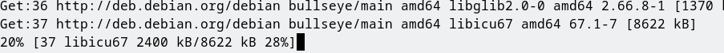
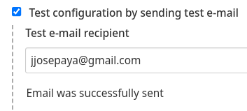
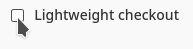
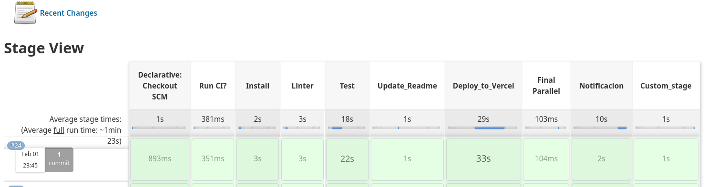

# Práctica Jenkins

Url del desplegamento vercel: https://jenkins-practica-jjpaya.vercel.app/

## ¿Qué es Jenkins?

Jenkins es un servidor de automatización de código abierto. Ayuda a automatizar las partes del desarrollo de software relacionadas con la creación, las pruebas y la implementación, lo que facilita la integración continua y la entrega continua.

Jenkins dispone de la funcionalidad de extenderse mediante plugins. Existen multitud de plugins que permiten cambiar el comportamiento de Jenkins o añadir nueva funcionalidad.

La seguridad en Jenkins depende de 2 factores: control de acceso y protección de amenazas externas. El control de acceso puede ser personalizado por 2 medios: autenticación y autorización de usuario. Protección de amenazas externas tales como ataques de CSRF y builds maliciosos, también son soportados.

# Tabla de contenidos

- [Práctica Jenkins](#práctica-jenkins)
  - [¿Qué es Jenkins?](#qué-es-jenkins)
- [Tabla de contenidos](#tabla-de-contenidos)
- [Instalación dependencias en el contenedor de Jenkins](#instalación-dependencias-en-el-contenedor-de-jenkins)
- [Instalar dependencias en package.json](#instalar-dependencias-en-packagejson)
- [Configurar credenciales necesarias para el Jenkinsfile](#configurar-credenciales-necesarias-para-el-jenkinsfile)
- [Crear job en Jenkins](#crear-job-en-jenkins)
- [Probar Jenkinsfile](#probar-jenkinsfile)

# Instalación dependencias en el contenedor de Jenkins

Se instalan las dependencias del sistema que va a necesitar cypress luego

# Instalar dependencias en package.json

El Cypress y el Vercel lo añado al package.json con `--save-dev`, para que Jenkins lo tenga disponible al hacer `npm install`:

# Configurar credenciales necesarias para el Jenkinsfile

Se han añadido las siguientes credenciales para que funcione la modificación del `README.md` y el deploy a Vercel

Se ha configurado el correo en el propio Jenkins:

El email de prueba se envió correctamente:

# Crear job en Jenkins

El lightweight checkout se ha desactivado para que no haya problemas con el historial de commits, ni con los tags al crear un commit/tag nuevo.

# Probar Jenkinsfile

La primera construcción va a fallar porque no ha detectado los parámetros aún.

Ya que uso funciones especiales de Jenkins en el Jenkinsfile, debo autorizar su uso para ese Job:

Una vez se autorize todo los permisos especiales y intentemos construir con parámetros...:

Vemos que los valores por defecto de los parámetros son los correctos. El email se obtiene de la cuenta de usuario de jenkins: 

La pipeline se ejecuta y finaliza correctamente:

Y vemos que se envía el correo de resultado:

Se muestra el código de salida de cada proceso ejecutado en los stages. 0 significa que no ha habido ningún error.

Puedes consultar el console output en [doc/console_output_24.md](doc/console_output_24.md)

Ahora podemos acceder a la aplicación desplegada:

Si hacemos que los tests de cypress fallen, vemos los siguientes resultados:

La pipeline no falla en sí, porque usa los estados de salida de los procesos en los siguientes stages.

Podemos comprobar que en el correo se nos ha notificado que el cypress ha tenido 11 errores, y el deploy_job no se ha ejecutado debido a que el resultado de cypress no ha sido 0.

Vemos que se ha creado y subido un commit (y un tag) con los cambios del readme. (La diferencia de hora es debido a que la zona horaria del contenedor de Jenkins no está bien configurada):

Puedes consultar el console output en [doc/console_output_25.md](doc/console_output_25.md)

Cuando pollSCM decida ejecutarse de nuevo por el commit que ha creado se va a saltar la construcción por el indicador `[ci skip]` que hay en el mensaje del commit:

RESULTADO DE LOS ULTIMOS TESTS:

