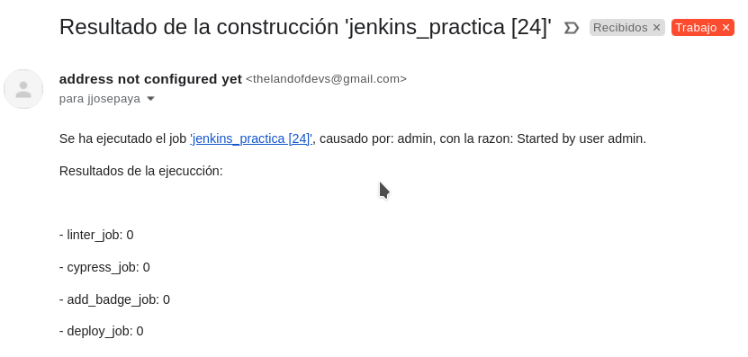
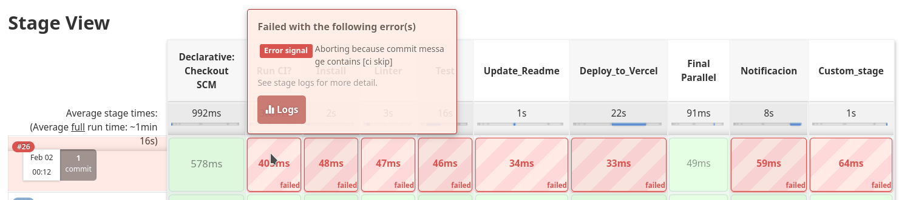

# Github Actions Práctica

Url del desplegamento vercel: https://gh-practica.vercel.app/

## ¿Qué es GitHub Actions?

GitHub Actions es una plataforma de integración y desplegamiento continuo (CI/CD) que te permite automatizar la compilación, los tests y el desplegamiento de tu proyecto. Puedes crear workflows que construyen y prueban cada pull request que se hace en tu repositorio, o desplegar pull requests aceptados directamente a producción.

GitHub Actions va más alla que solo DevOps, y te permite ejecutar workflows cuando otros eventos ocurren en tu repositorio, como por ejemplo, para añadir etiquetas en los tickets nuevos de tu repo.

Se proporcionan máquinas virtuales de Linux, Windows y MacOS para ejecutar los workflows, e incluso puedes hostear tu mismo runners para ejecutar los actions.

# Tabla de contenidos

- [Github Actions Práctica](#github-actions-práctica)
  - [¿Qué es GitHub Actions?](#qué-es-github-actions)
- [Tabla de contenidos](#tabla-de-contenidos)
- [Clonar e inicializar repo](#clonar-e-inicializar-repo)
  - [Instalar las dependencias](#instalar-las-dependencias)
  - [Instalar el linter](#instalar-el-linter)
- [Ejecutar linter y arreglar errores](#ejecutar-linter-y-arreglar-errores)
- [Crear el workflow](#crear-el-workflow)
  - [Job del Linter](#job-del-linter)
  - [Job de Cypress](#job-de-cypress)
  - [Job del Badge](#job-del-badge)
    - [Acción badge](#acción-badge)
  - [Job de deploy a Vercel](#job-de-deploy-a-vercel)
  - [Job de notificación por email](#job-de-notificación-por-email)
    - [Acción email](#acción-email)
  - [Job custom: bump de version semántica menor](#job-custom-bump-de-version-semántica-menor)
    - [Acción custom](#acción-custom)
- [Prueba del workflow](#prueba-del-workflow)
  - [Con Cypress fallando tests](#con-cypress-fallando-tests)
  - [Con Cypress pasando tests](#con-cypress-pasando-tests)

# Clonar e inicializar repo

Se clona el repositorio dado y se limpian los commits anteriores:

## Instalar las dependencias

Se ejecuta un `npm install` para instalar las depedencias especificadas en el `package.json`.

## Instalar el linter

Al intentar ejecutar el lint, el comando falló porque no está incluido en las dependencias del `package.json`.

# Ejecutar linter y arreglar errores

Se ejecuta el linter para ver los errores que existen en el código con `npm run lint`:

Hay unos cuantos, y como el linter tiene una opción de `--fix`, pues la ponemos a prueba:

Como vemos ha arreglado todos los errores menos uno.

Editamos el archivo `./pages/api/users/index.js` y reordenamos el `default:` para que sea el último en el switch, y de paso, cambiamos `POST0` a `POST`:

Una vez hecho eso, ejecutamos el lint otra vez para ver si quedan errores:

# Crear el workflow

## Job del Linter
Se crea la carpeta para el workflow y se procede a crear el archivo yml:

El job del linter se ha copiado de las prácticas anteriores.

## Job de Cypress

Se crea el siguiente job para `cypress-job`:

Dependerá de `lint-run`, y hara checkout del código, usará `cypress-io/github-action@v2` y continuará con el workflow en caso de que haya un error.

Se especifica que tiene que construir y iniciar el proyecto para poder realizar los tests, y que utilize el archivo de configuración del repositorio.

Una vez hecho ese step, se guarda su resultado en el archivo `result.txt` con un simple comando `echo`.

Este archivo creado (`result.txt`) lo subimos como artefacto con la acción `actions/upload-artifact@v2`.

## Job del Badge

Para el job del badge se ha escrito lo siguiente:

Dependerá de `cypress-job`, y se ejecutará siempre.

El job hace checkout al código, y se descarga el artefacto del anterior job, para establecerlo como un output del step con el comando `echo`.

Se pone id al step para poder acceder a sus outputs luego, en la acción del badge como input.

Una vez ejecutada la acción del badge, se hace commit de los cambios realizados, con la ayuda de la acción `stefanzweifel/git-auto-commit-action@v4`, para solo el archivo `README.md`.

### Acción badge

La acción badge contiene 2 archivos: `action.yml` y `badge.sh`.

El action contiene lo siguiente:

Es una acción composite que tiene un input que le paso como parámetro al script ejecutado.

El script es bastante simple, solo si el primer parámetro es igual a "success" se pondrá el badge verde.
Luego se utiliza `sed` para reemplazar el link utilizado en la imagen del readme que tiene `cyp-badge` como descripcion alt.

## Job de deploy a Vercel

El job de deploy depende de `cypress-job` y subirá el proyecto a vercel utilizando la acción `amondnet/vercel-action@v20`.

Se han obtenido los secretos creando una cuenta y proyecto en Vercel:

El proyecto se ha creado vacío, con la opción de next.js marcada.

En los ajustes del proyecto veremos nuestro token de proyecto.

Se agrega a los secretos de repositorio como `PROJECT_ID`.

También se agregan los otros tokens `VERCEL_TOKEN`, conseguido desde tu perfil, y el ID de organización que es en realidad el ID de usuario que también puedes obtener desde tu perfil.

## Job de notificación por email

El job de enviar correo dependerá de todos los jobs anteriores, y se ejecutará siempre.

Se puede ver que se utiliza un username y password. El username es el correo de mi cuenta de gmail, y el password es una contraseña de aplicación, que permite al código iniciar sesión al correo de mi cuenta sin que Google se queje.

El destinatario del mensaje también es un secret, y lo recibo yo mismo.

Después indico quien envía el correo, el sujeto del mensaje y el cuerpo.

El cuerpo contiene información sobre la rama, el repositorio y los resultados de los jobs anteriores.

### Acción email

La acción del email tiene unos cuantos inputs y ejecuta un index.js compilado con el compilador `ncc` de Vercel.

Y el código javascript es el siguiente:

Se utiliza la librería `nodemailer` para facilitar el envío del correo. Con eso, el código es bastante simple.

## Job custom: bump de version semántica menor

Para el job custom, se realiza un job y action que subirán en 1 la versión menor (bugfix) del proyecto por cada push realizado en la rama principal.

El job dependerá de `cypress-job` y `add-badge-job`.
Se depende de `add-badge-job` para esperar a que el posible commit para cambiar el badge del README se realice, y asi evitar conflictos al establecer y subir el tag.

El checkout se necesita con `fetch-depth: 0` para obtener el último tag realizado.

### Acción custom

En esta acción no hay ni inputs ni outputs, pero si que se usa un output de step para obtener el ultimo tag del repositorio.

Este tag es proporcionado a `christian-draeger/increment-semantic-version@1.0.2` para que genere la siguiente version menor (bugfix) en uno de sus outputs.

Una vez ejecutado ese action se crea el tag en el repositorio utilizando `actions-ecosystem/action-push-tag@v1` y dándole el tag de salida en la acción anterior.

# Prueba del workflow

## Con Cypress fallando tests

Enlaces:

- Commit: https://github.com/jjpaya/gh_practica/tree/b33fd30425240ee10e07790c902edfc9710c3bf0
- Acción: https://github.com/jjpaya/gh_practica/actions/runs/1573749097

Se puede ver que aunque cypress haya fallado, el workflow continua como si nada hubiera pasado. Se puede ver abajo que los tests de cypress no se han realizado correctamente.

El badge se actualiza como debería y podemos ver que en el readme los tests fallan:

## Con Cypress pasando tests

Enlaces:

- Commit y acción: (El más reciente)

En este run los tests de cypress no han fallado, y se puede ver que no hay una anotación abajo como antes que indica que ha ido mal.

El correo enviado refleja el estado de los jobs en el run del GitHub Actions.

Se realiza el cambio del badge del README, y podemos ver que el badge esta verde:

En vercel podemos ver que el proyecto se ha desplegado correctamente y que su estado es Ready:

Y si entramos en el enlace del proyecto en vercel vemos la página desplegada:

RESULTADO DE LOS ULTIMOS TESTS:
